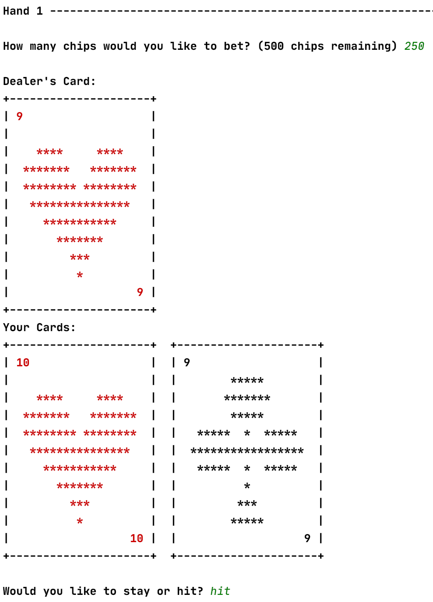
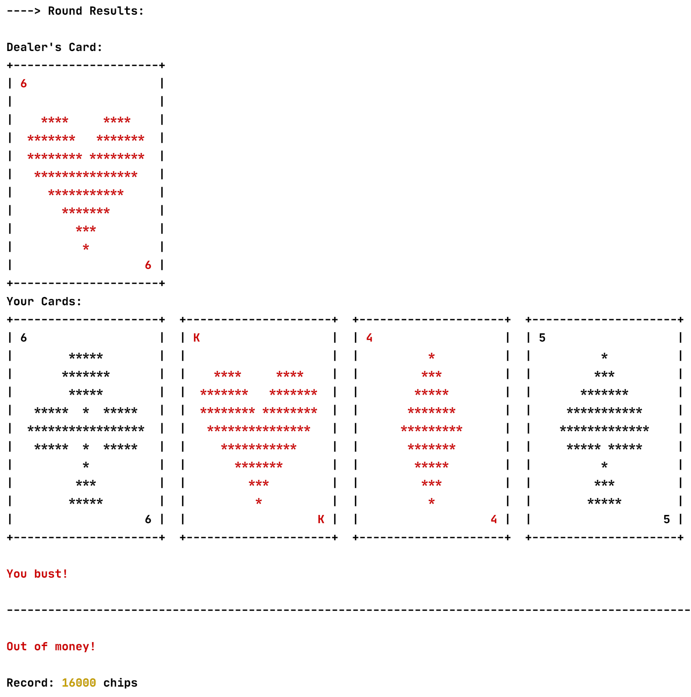

# BlackJack
BlackJack game that visually displays hands using ASCII characters. The card display may vary based on where you run the code (IDE, Command Line, etc...). Use virtual environment to access the different colored output and white console background for the best experience.

